<p align="center">
  
</p>

<h1 align="center">Do ResNets Route? Sparse Interaction Experts in Residual Networks</h1>

<p align="center">
  <a href="https://divinyan.com/resnets-route-without-routers">
    
  </a>
</p>

<p align="center">
  
</p>

<p align="center">
  <strong>Liang Yan<sup>1,*</sup></strong>&nbsp;&nbsp;
  <strong>Siying Chen<sup>2</sup></strong>&nbsp;&nbsp;
  <strong>Kaijie Chen<sup>3</sup></strong>&nbsp;&nbsp;
  <strong>Bo Li<sup>1</sup></strong>&nbsp;&nbsp;
  <strong>Jinghao Zhang<sup>4</sup></strong>&nbsp;&nbsp;
  <strong>Mu Miao<sup>5</sup></strong><br>
  <sup>1</sup>Fudan University&nbsp;&nbsp;
  <sup>2</sup>University of Washington&nbsp;&nbsp;
  <sup>3</sup>Tongji University<br>
  <sup>4</sup>Shandong University&nbsp;&nbsp;
  <sup>5</sup>Datacanvas<br>
  <sup>*</sup>Corresponding author:
  <a href="mailto:yanliangfdu@gmail.com">yanliangfdu@gmail.com</a>
</p>

<p align="center">
  <a href="mailto:yanliangfdu@gmail.com">
    
  </a>
</p>

This repository contains the evaluation code and numerical tables for studying
**implicit functional routing** in pretrained residual networks.  A standard
ResNet executes every block for every input; here, binary residual-branch masks
are used only as analytical interventions.  Boolean Möbius inversion then
decomposes the masked response exactly into individual residual corrections and
higher-order interactions.

<p align="center">
  <em>From dense residual execution to input-dependent interaction experts.</em>
</p>

<p align="center">
  
</p>


## News

- **2026-10-01:** Project page released at [Project Page](https://divinyan.com/resnets-route-without-routers).
- **2026-09-26:** Code released.


The release is organized around the paper's six observations.  Directory names
describe the scientific question rather than an experiment number.

---

## Repository layout

```text
.
├── data/
│   ├── README.md
│   └── indices/                         # frozen ImageNet sample selections
├── experiments/
│   ├── naive_additive_reconstruction/
│   ├── interaction_order_spectrum/
│   ├── residual_scaling_sweep/
│   ├── topk_interaction_reconstruction/
│   ├── input_dependent_expert_sets/
│   └── difficulty_interaction_complexity/
├── scripts/
│   ├── prepare_sample_index.py
│   └── setup_environment.sh
├── src/resnet_routes/
│   ├── resnet18/
│   └── resnet34/
└── tests/
```

Each experiment directory contains:

- a concise README with the hypothesis, protocol, and commands;
- model-specific evaluation and, where needed, analysis entry points;
- `results/resnet18.md` and `results/resnet34.md`, the numerical tables used in
  the paper; and
- a lightweight smoke-test script for checking an installation.

Plotting programs and generated figures are deliberately excluded.  This
repository releases the numerical evaluation pipeline and tabular evidence;
users may visualize the committed tables or regenerated machine-readable
outputs with their own tools.

---

## Findings at a glance

| Analysis | Main finding |
| --- | --- |
| Naive additive reconstruction | Sums of masked-network responses overcount shared effects; Möbius inversion reconstructs the full logits to numerical precision. |
| Interaction-order spectrum | Interaction mass peaks at order 5 in ResNet-18 and order 10 in ResNet-34, rather than at low orders. |
| Residual-scaling sweep | Reducing the residual scale shifts mass toward lower orders, but it also changes model predictions. |
| Top-K reconstruction | Coefficient mass is concentrated, while prediction-preserving reconstruction retains a decision-relevant tail, especially in ResNet-34. |
| Input-dependent expert sets | Dominant interactions combine a shared global core with input-dependent and predicted-class structure. |
| Difficulty and complexity | Interaction complexity changes little with sample difficulty; inputs change *which* interactions dominate more than *how much* interaction machinery is used. |

---

## Installation

A CUDA-capable machine is strongly recommended.  The full analyses enumerate
all `2^8=256` masks for ResNet-18 and all `2^16=65,536` masks for ResNet-34.

```bash
git clone https://github.com/yanliang3612/resnets-route-without-routers.git
cd resnets-route-without-routers
bash scripts/setup_environment.sh
source .venv/bin/activate
```

The tested software versions and an equivalent manual installation are listed
in `environment.yml` and `requirements.txt`.  Torchvision downloads the
official ImageNet-pretrained weights on first use unless they are already in
the PyTorch cache.

Run the unit tests with:

```bash
PYTHONPATH=src python -m unittest discover -s tests -v
```

For a quick end-to-end check without ImageNet, run any experiment's
`smoke_test.sh`.  Synthetic runs verify execution only and do not reproduce the
paper's numbers.

---

## ImageNet data

ImageNet images are not redistributed.  The evaluators read Hugging Face-style
ImageNet-1K parquet shards and use the frozen selections in `data/indices/`.
Set the shard directory once:

```bash
export IMAGENET_PARQUET_DIR=/absolute/path/to/imagenet-1k/data
```

The runners accept `--parquet-dir "$IMAGENET_PARQUET_DIR"` and remap the shard
basenames stored in the index files to that directory.  See
[`data/README.md`](data/README.md) for expected shard patterns, selection
protocols, and instructions for creating a new index.

---

## Reproducing the six analyses

All commands below are launched from the repository root.  The individual
READMEs give complete model-specific commands and enumerate their output files.

```bash
# Replace NAME with one of the six directory names above.
bash experiments/NAME/smoke_test.sh
```

Full ImageNet runs are computationally expensive.  ResNet-34 evaluations use a
streaming implementation with checkpoints; use `--resume` when supported and
write generated artifacts under `runs/` rather than overwriting the committed
reference tables.

---

## Results and reproducibility boundary

The Markdown tables under each `results/` directory are immutable snapshots of
the reported runs.  JSON verification metadata are included where available.
Large per-image tensors, model checkpoints, ImageNet data, run logs, cached
activations, and visualization artifacts are intentionally omitted.  A fresh
run writes its own summaries and per-image intermediates to the chosen
`--output-dir`.
